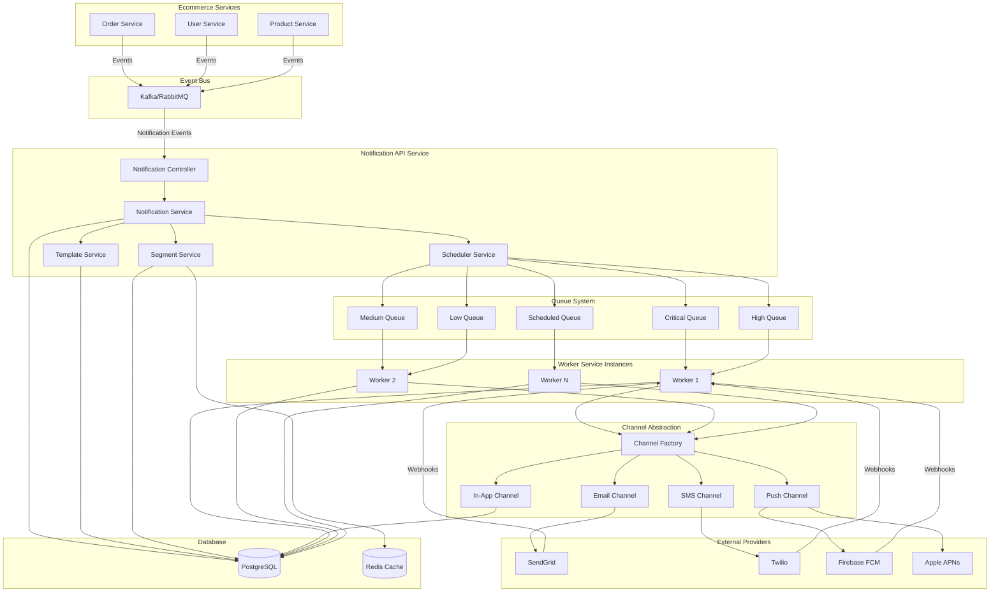
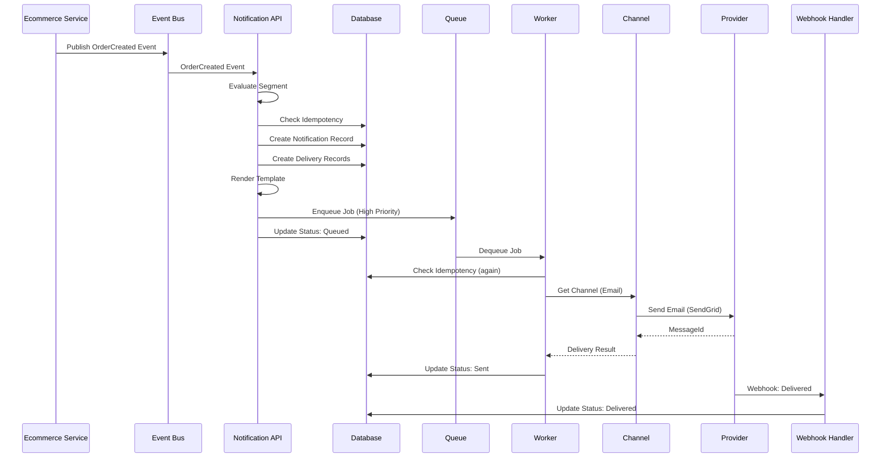
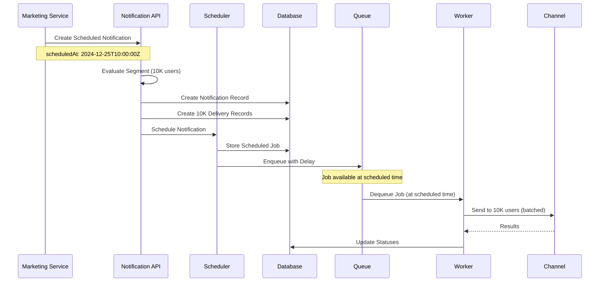
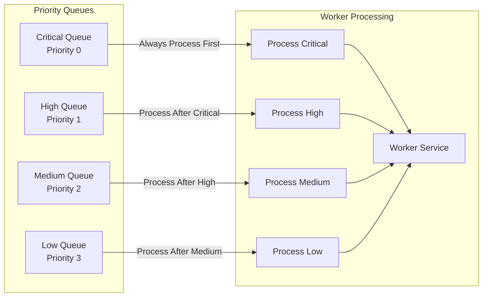
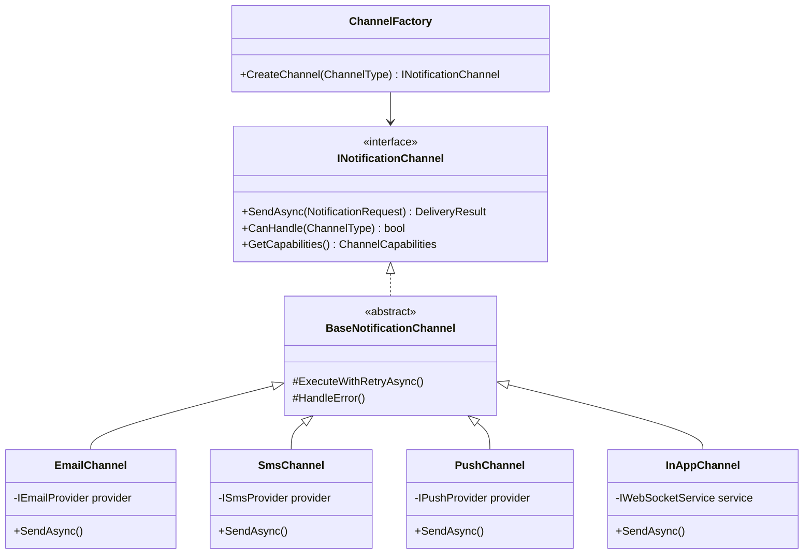
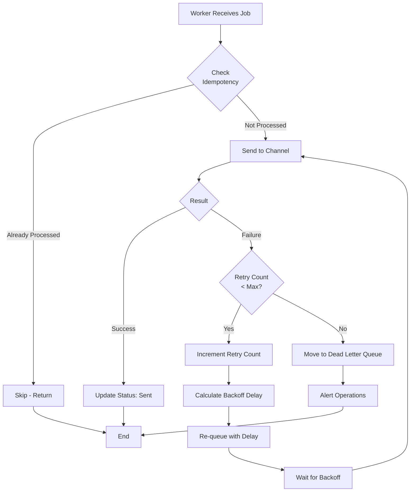
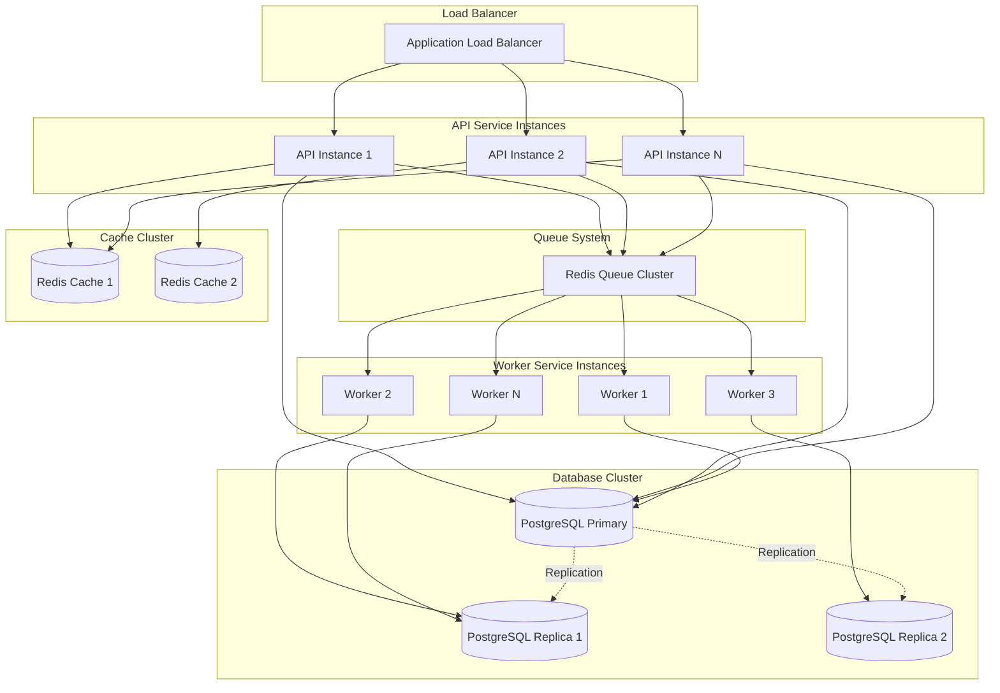
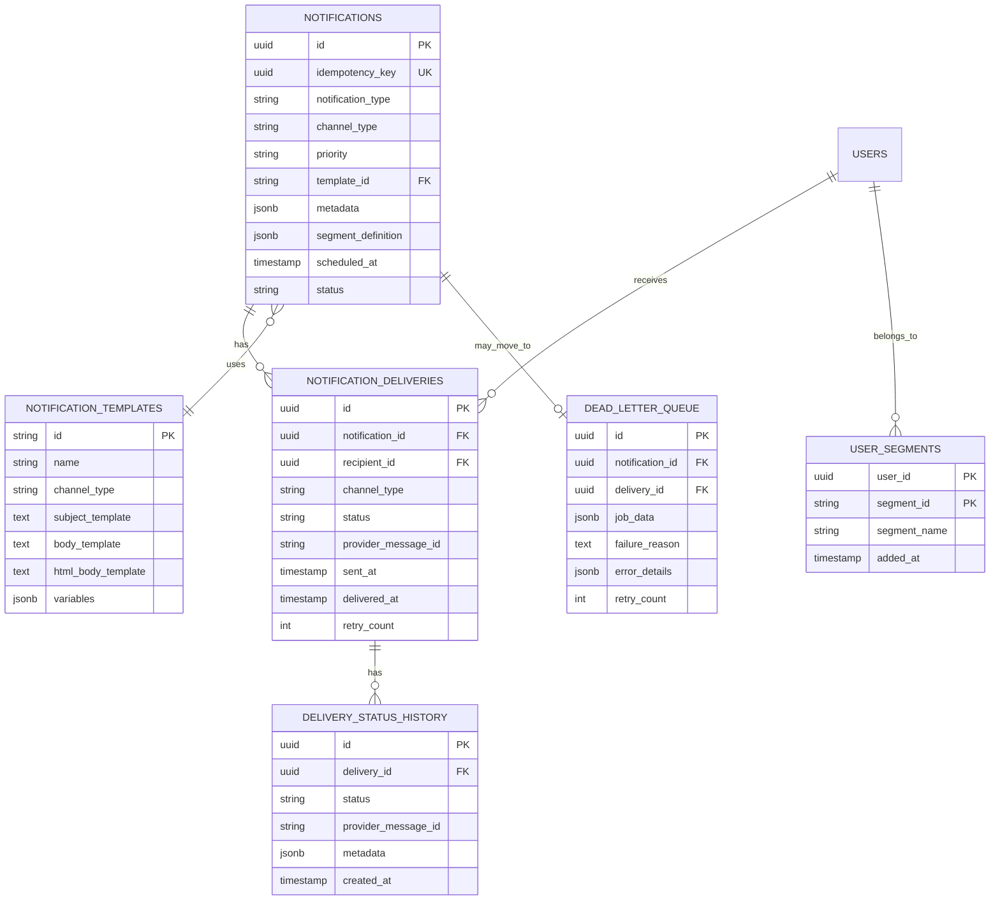
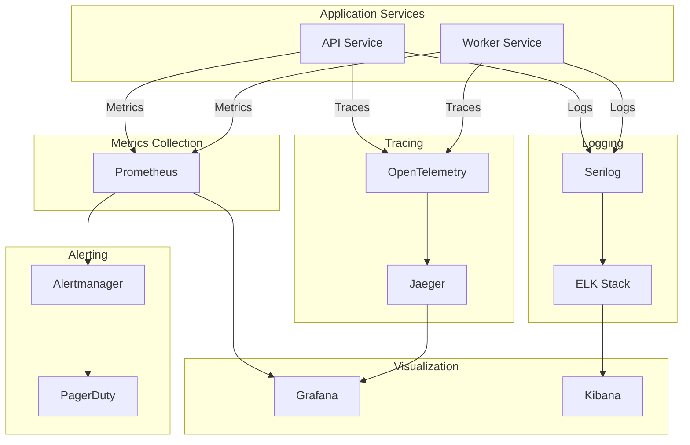

# Notification System - Architecture Diagrams

## System Architecture Overview

## Notification Flow - Immediate Notification

## Notification Flow - Scheduled Notification

## Priority Queue Processing

## Channel Abstraction Pattern

## Retry & Failure Handling

## Scalability Architecture

## Data Model Relationships

## Monitoring & Observability Stack

---

## How to View These Diagrams

### Option 1: GitHub/GitLab
- These Mermaid diagrams will render automatically in GitHub/GitLab markdown viewers

### Option 2: VS Code
- Install "Markdown Preview Mermaid Support" extension
- Open markdown file and use preview

### Option 3: Online Tools
- Copy diagram code to [Mermaid Live Editor](https://mermaid.live/)
- Export as PNG/SVG

### Option 4: CLI Tools
- Install Mermaid CLI: `npm install -g @mermaid-js/mermaid-cli`
- Convert to image: `mmdc -i diagram.md -o diagram.png`

---

*These diagrams provide visual representation of the notification system architecture. They complement the detailed design document.*

